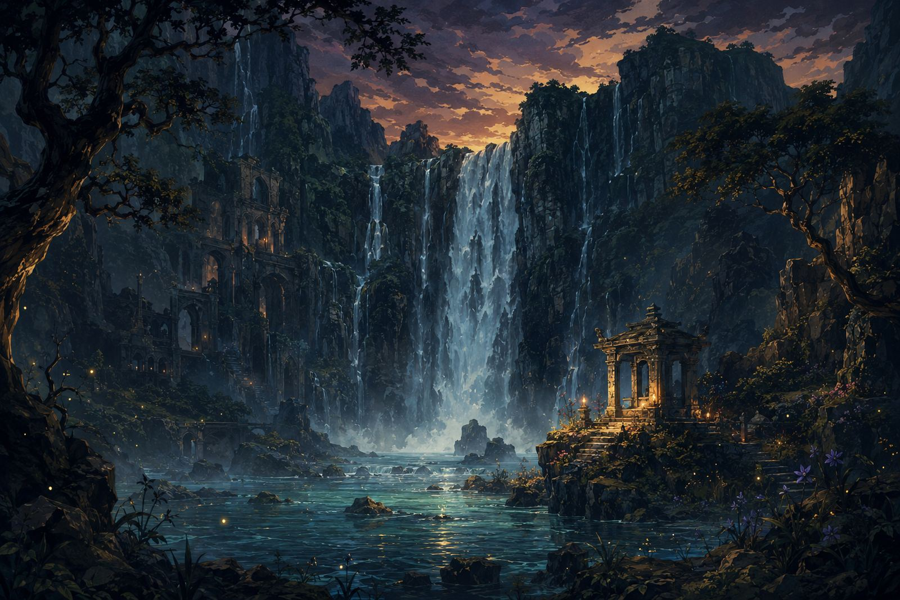

# ⛲ اختبار الشلال — أي مهنة تناسبك؟

اختبار شخصية عربي بروح الـJRPG الكلاسيكية:
تجاوب على أسئلة «عرّافة الشلال» وتكتشف أي مهنة مغامرة تناسب روحك — وهل تقودك خياراتك إلى نهاية جيدة أم سيئة.

**جرّبه الآن:** https://ikhtibar-al-shallal.netlify.app



## المميزات

- **7 مهن** بروح الـJRPG الكلاسيكية: المحارب، المقاتل، الساحر، الكاهنة، اللص، التاجر، المهرّج
- **«البَطَل»** — نتيجة نادرة ★ لا تظهر إلا لمن كانت إجاباته متوازنة بين المهن
- **بنك 30 سؤالاً** — كل جولة تسحب 10 عشوائياً بترتيب عشوائي، فكل إعادة تجربة مختلفة
- **نتيجة غنية**: وصف سريع، نقاط قوة ونقاط ضعف، و**نهاية جيدة أو سيئة** حسب حسم خياراتك — مع مشهد نهاية مرسوم لكل حالة
- **بطاقة نتيجة قابلة للمشاركة** — تُرسم بـCanvas (1200×1560) وتعرض كل شيء: البورتريه والوصف والقوة والضعف والنهاية ونسب التوافق
- مشاركة أصلية على الجوال (Web Share API)، تغريدة جاهزة، وتحميل PNG
- أصوات retro مولّدة بـWebAudio (بدون ملفات صوتية) مع زر كتم
- رسومات بأسلوب Fire Emblem / Final Fantasy الكلاسيكي مولّدة بالذكاء الاصطناعي
- يدعم الجوال والآيباد والكمبيوتر، RTL بالكامل

## التشغيل محلياً

الموقع ملف HTML واحد بدون أي build:

```bash
python3 -m http.server 8123
```

ثم افتح http://localhost:8123 — (لا تفتح الملف بـ`file://` مباشرة؛ تصدير صورة النتيجة يحتاج سيرفر).

## البنية

```
index.html        ← كل شيء: HTML + CSS + JS
assets/           ← الرسومات (بورتريهات، خلفية، زخرفة، أيقونة)
art-source/       ← الصور الأصلية بدقة كاملة قبل القص والتصغير
HANDOFF.md        ← دليل المطور: كيف تعدل الأسئلة والمهن والرسومات والنشر
```

## النشر

| | |
|---|---|
| الإنتاج | [ikhtibar-al-shallal.netlify.app](https://ikhtibar-al-shallal.netlify.app) — فريق Netlify: `nathoool92` |
| احتياطي | [aragonaragon.github.io/waterfall-quiz](https://aragonaragon.github.io/waterfall-quiz/) — GitHub Pages |

التفاصيل الكاملة للتعديل والنشر في [HANDOFF.md](HANDOFF.md).
